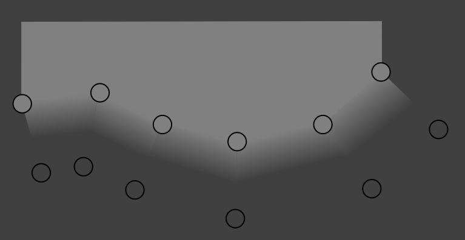

# PLG

PLGs (likely Planar Line Graph) are compiled 2D mesh collection files.

These meshes are used mostly as backgrounds to various UI elements in Atlus games.

## Format

**Note:** everything below has been reversed very superficially and some assumptions were made (i.e. expect mistakes).

PLG files are little-endian.

- Header:
  - Signature - "PLG0"
  - Mystery Bytes - Likely the PLG format or game version
    - Known values:
      - `0x01000400` - Persona 5 -- header size 0x38 (object size 0x48)
      - `0x01000300` - Persona 5 -- header size 0x20 (object size 0x40)
      - `0x01000200` - Persona 5 -- header size 0x20 (object size 0x40), `fclItem.plg` only
      - `0x00000002` - Persona Q2, Persona 3 Dancing, Persona 5 Dancing -- header size 0x38 (object size 0x48)
    - File Size * (rounded up to closest multiple of 4)
    - Total Object/Vert/FaceIdx count
- Objects (for each object):
  - Vert/Face data offsets **
  - EOF offset *
  - Vert/FaceIdx count
  - Face n-gon size (All faces must contain the same number of verts)
  - Min/Max XY values relative to verts associated with this object
  - Name
- Verts (for each object):
  - RGBA Vert Color - By default, boundary verts are colored `0xffffff00` and non-boundary verts are colored `0xffffffff`
  - XY position
  - Flags:
    - `0x00010000` - vert is boundary
    - `0x0000xxxx` - setting a bit in this section seems to affect transparency or starts a "show-hide" animation when the vert is displayed
- Faces (for each object):
  - A list of face indices

`*` Only for header (object) size 0x38 (0x48).

`**` Always 0 when Mystery Bytes value is `0x01000200`.

## Notes

PLG meshes usually contain two "loops" of verts - an inner loop and an outer loop.

These loops contain the same number of verts.

By default, PLGs are rendered with no AA, so mesh edges would appear jagged.

However, verts on the outer loop have a vertex color of `0xffffff00`, and verts on the inner loop have a vertex color of `0xffffffff`.

From the above, rendering the mesh with the interpolated vertex color value nets the following effect (`#ffffffxx` replaced with `#808080xx` for readability):

This effect makes the edges (which are actually between the outer and inner loops) appear Anti-Aliased.
