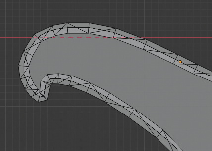
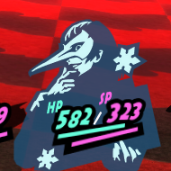

# Practical Example #1 - Darkechi Battle Portrait

## Creating the Background Mesh (PLG)

**Step 0:** The mesh collection that contains the mesh to be replaced was imported into Blender.

In this case, the original mesh was in `battle_active_pp.plg`.

**Step 1:** The dark background was extracted from the reference image below using GIMP (color to alpha + levels), traced using Inkscape (all curved points were converted to corners) and imported into Blender. Note that no tracing/extracting is required, as the mesh can be created by tracing the reference image directly.

||||
|:-:|:-:|:-:|
||||

**Step 2:** The meshes were aligned (this step is optional, as alignment can be done later via EBOOT patching).

In this case, the source reference image was overlaid over the source mesh, then the target reference image was aligned with the source reference image.

Later, the imported path was aligned with the target reference image (not pictured below).

|||
|:-:|:-:|
|||
|||

**Step 3:** The frame was created step by step, while making sure that the edge of the traced object was always in the middle.

Faces should, in general, never overlap. Faces should also never "fold over" other faces.

Finally, the edge loops were bridged.

|||
|:-:|:-:|
|||
|||

**Step 4:** All faces in the frame mesh were triangulated.



**Step 5:** The inner edge loop was face filled.


**Step 6:** The final result.

|||
|:-:|:-:|
|||

At this point, the mesh can be moved into the imported PLG collection.

In this case, the new mesh was appended as the last mesh in the PLG collection, and the reference to the old mesh will later be replaced by a reference to the new one. In the case of battle portraits, the meshes are referenced by index in the EBOOT.

## Creating the Foreground Sprite (SPD)

The foreground sprite was separated from the background using GIMP.


Using PersonaEditor, the spritesheet was exported from `p5_battle_partypanel.spd` to `p5_battle_party.dds`.

The sprite was scaled using reference images taken from Blender, as they already are in the correct scale for the portrait.

|||||
|:-:|:-:|:-:|:-:|
|||||

The final result.


Finally, the new spritesheet was imported back into the SPD using PersonaEditor and an empty, unused sprite entry was replaced with a reference to the new sprite.

## Aligning the Parts (EBOOT)

After booting the game using RPCS3 and loading the mod, the references to the old mesh/sprite needed to be changed.

The mesh/sprite themselves were properly aligned in the PLG/SPD and did not need to be moved in this case.

The bottom ailment effects were misaligned, and needed to be adjusted.

||||
|:-:|:-:|:-:|
||||

Alignment was done using the following EBOOT patch:

```yml
p5_darkechiPortrait: &p5_darkechiPortrait
    - [ be32, 0x00B664C0, 51 ] # spdIdx (59)
    - [ be32, 0x00B664E8, 8 ] # plgIdx (7)
    - [ be32, 0x00B66BCC, 52 ] # ailTopX (12)
    - [ be32, 0x00B66BD4, -48 ] # ailBottomX (-28)
    - [ be32, 0x00B66BD8, -14 ] # ailBottomY (36)
```

The final result is shown below.


