# Practical Example #2 - Sojiro Battle Portrait

## Creating the Background Mesh (PLG)

**Step 0:** The mesh collection that contains the mesh to replace was imported into Blender.

In this case, the original mesh was in `battle_active_pp.plg`.

**Step 1:** The reference image was imported into Blender.

||
|:-:|
|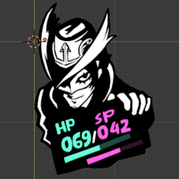|

**Step 2:** The target reference image was aligned with the source mesh using the source reference image to bridge the two.

||||
|:-:|:-:|:-:|
|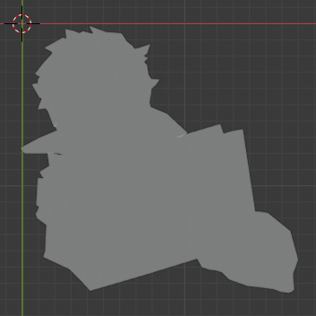|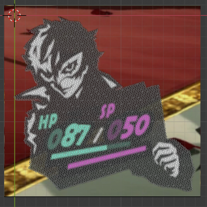|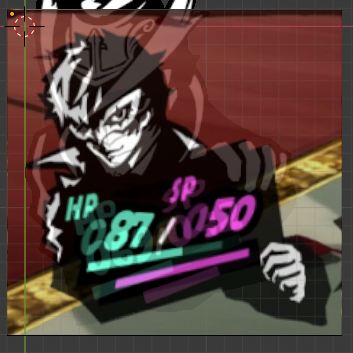|

**Step 3:** The frame was created step by step, while making sure the edge of the traced object was always in the middle.

Finally, the edge loops were bridged.

||||
|:-:|:-:|:-:|
|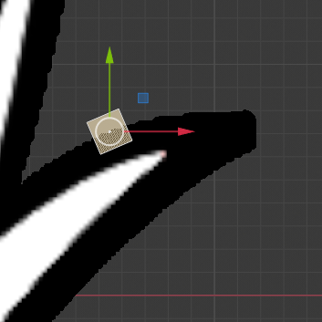|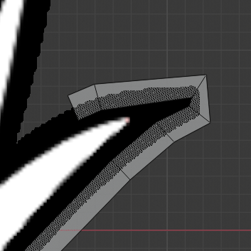|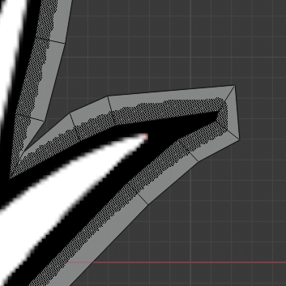|

**Step 4:** All faces in the frame mesh were triangulated.

||
|:-:|
|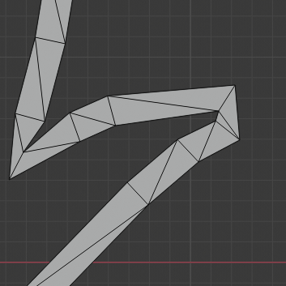|

**Step 5:** The inner edge loop was face filled.

||
|:-:|
|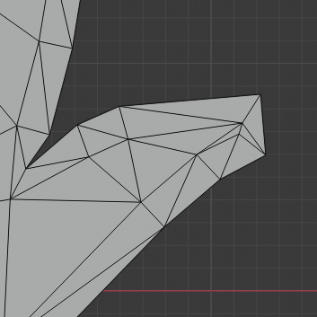|

**Step 6:** The final result.

||
|:-:|
|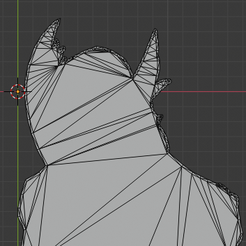|

Now, the mesh can be moved into the imported PLG collection.

To replace the original mesh:

- The original mesh was moved outside the PLG collection as a backup.
- The new mesh was moved into the PLG collection.
- The new mesh object was renamed so that it takes the same position in the PLG collection as the original mesh did.

## Creating the Foreground Sprite (SPD)

The foreground sprite was separated from the background using GIMP (color to alpha + levels).

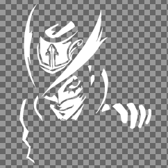

Using PersonaEditor, the spritesheet was exported from `p5_battle_partypanel.spd` to `p5_battle_party.dds`.

Then the spritesheet was expanded from 1024x1024 to 2048x2048 and the new sprite was inserted.

The sprite was scaled using reference images taken from Blender, as they were already in the correct scale for the portrait.

|||||
|:-:|:-:|:-:|:-:|
|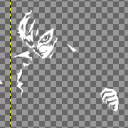|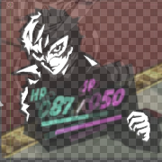|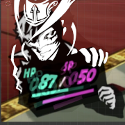|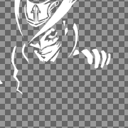|

The final result.

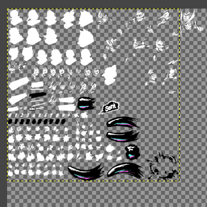

Finally, the new spritesheet was imported back into the SPD using PersonaEditor and the original sprite's bounding box was moved over the new sprite.

## Aligning the Parts (EBOOT)

After booting the game using RPCS3 and loading the mod, the new parts needed to be aligned.

Alignment was done using the following EBOOT patch:

```yml
p5_sojiroPortrait: &p5_sojiroPortrait
    - [ bef32, 0x00B66ABC, -71  ] # spdX (-78)
    - [ bef32, 0x00B66AC0, -144 ] # spdY (-104)
    - [ bef32, 0x00B66ACC, 17   ] # ailTopX (-13)
    - [ bef32, 0x00B66AD0, -35  ] # ailTopY (-45)
```

First the SPD was aligned over the PLG, and then the top ailment effect was moved to account for the new portrait's shape.

||||
|:-:|:-:|:-:|
|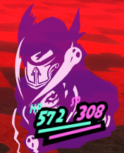|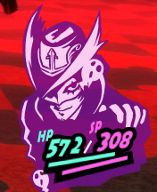|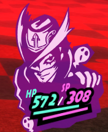|

The final result is shown below.

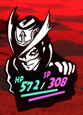
